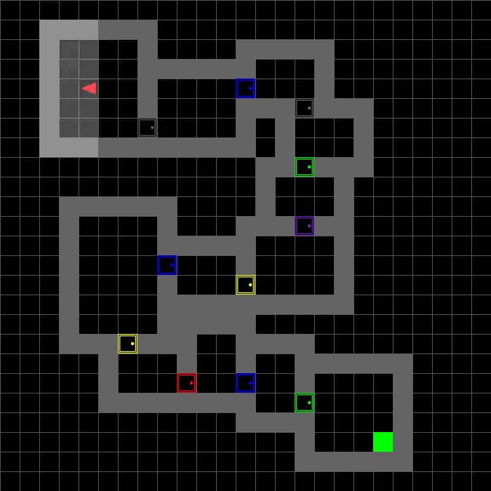
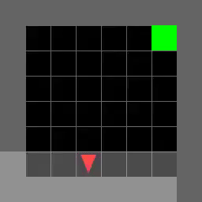
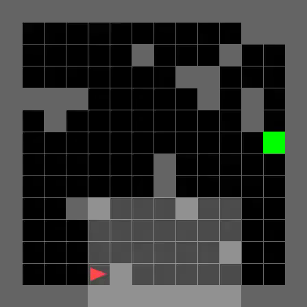
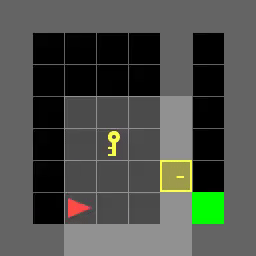
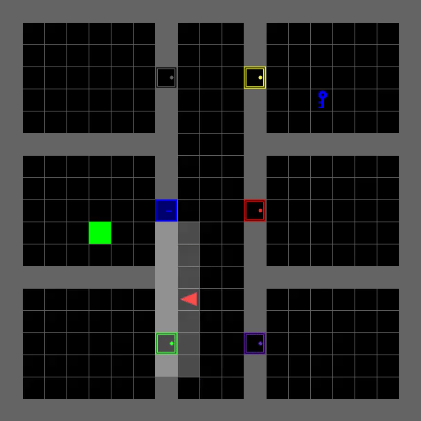
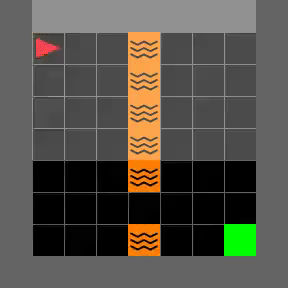
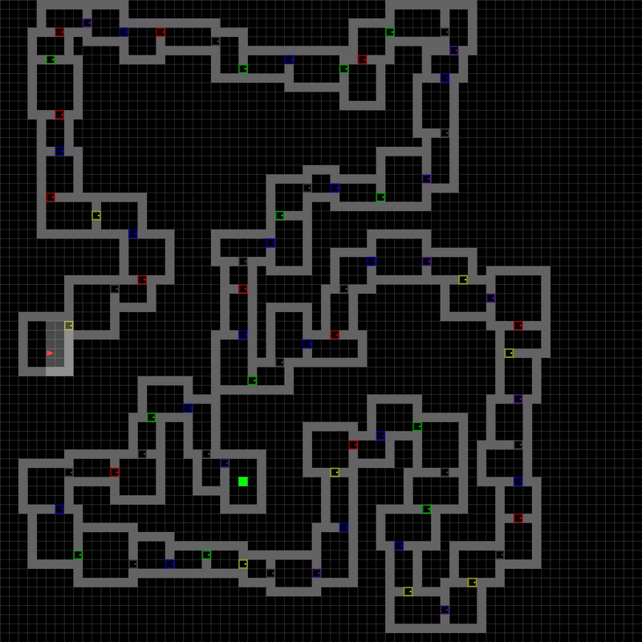

# 🧠 Curriculum Learning in POMDPs


> **Short Summary:** This project implements a Reinforcement Learning agent capable of solving complex, partially observable environments (MiniGrid) by leveraging **Curriculum Learning** and **Memory (GRU)**.

## 🎥 The Agent in Action


*Multiroom Environment*

## 🧐 The Challenge

The agent has to find the green goal square in maze-like environments. This presents three major difficulties:

1.  **Partial Observability (POMDP):** The agent only sees a tiny cone in front of it (7x7 pixels). Standard RL have a hard time here because the immediate observation doesn't reveal the agent's location.
2.  **Sparse Rewards:** In complex mazes like `Big-Multiroom`, finding the goal by random exploration is statistically nearly impossible.
3.  **Memory Requirement:** Without looking back or remembering past observations (e.g., keys or doors found), the agent can get stuck in loops.

## 💡 Conquering the Problems

### 1. Curriculum Learning (The "School" Method)
Instead of forcing the agent to solve the hardest maze immediately, I implemented a curriculum that progressively increases difficulty. 
* **The Problem:** In large environments with random seeds, the sequence of actions required to find a reward is too long for random exploration. The agent never sees a reward, so gradients remain zero.
* **The Solution:** By training on sub-tasks first (e.g., just opening a door, then finding a key), the agent learns distinct skills. This dramatically boosts convergence speed and allows the agent to generalize to unseen, larger maps.

### 2. Memory (The "Temporal" Context)
To handle the **Partial Observability**, I replaced the standard feed-forward network with a **GRU (Gated Recurrent Unit)**.
* This allows the agent to maintain a hidden state vector, effectively serving as a working memory.
* The agent can "remember" where it has been and which items (keys/balls) it has already interacted with, enabling long-term planning.

## 📊 Results & Generalization

The combination of Curriculum Learning and Memory yields an extremely versatile agent. The videos below show the agent's progression and its ability to generalize to environments **not seen during training**.

| |                                   |
|:---:|:---------------------------------:|
|  |         |
| *The basic atom* |        *More challenging*         |
|  |     |
| *Unlock with key* |        *Unlock right door*        |
|  |  |
| *Crossing Lava* |            *Big maze*             |


## 🛠️ Tech Stack
* **Language:** Python 3.8+
* **Library:** PyTorch, Gymnasium, Minigrid (https://minigrid.farama.org/)
* **Algorithm:** Proximal Policy Optimization (PPO) with GRU (Recurrent Policy)


## 🚀 Getting Started

### ⚙️ Global Configuration (Important)
The project relies on a central configuration file: **`config.py`**. 
Before running any scripts, please review this file. It acts as the "control center" for the entire project:
* **Shared Settings:** Both training and evaluation scripts fetch their environment parameters and model checkpoints directly from here.
* **Customization:** Use this file to switch between environments, model-versions, or adjust hyperparameters.

### 📦 Installation
Clone the repository and install the dependencies:

```bash
git clone https://github.com/FelixDobro/Curriculum.git
cd Curriculum
pip install -r requirements.txt
```

### 🏋️ Training
To start the training loop (which uses the settings from `config.py`), navigate to the training directory and execute the script:

```bash
cd training
python Curriculum.py
```

### 🎬 Evaluation
To record videos or measure success rates, change to evaluation dir (which uses the settings from `config.py`), navigate to the training directory and execute any script:

```bash
cd evaluation
python [script].py
```

*Created by Felix Dobrovich - 2025*